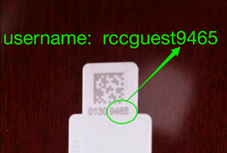

# About this document

This is an R Markdown Notebook.
[R Markdown](http://r4ds.had.co.nz/r-markdown.html) combines
[Markdown](http://daringfireball.net/projects/markdown), a popular,
easy-to-read plain text formatting syntax, with "chunks" of R
code. R Markdown notebooks can be easily rendered into various formats
(PDF, HTML, *etc.*) for sharing your code and results with 
collaborators.

This notebook contains code to reproduce some of my analyses of the
[NHGRI-EBI GWAS Catalog](http://www.ebi.ac.uk/gwas/). The GWAS Catalog 
provides results from thousands of genome-wide association studies of 
inherited diseases and completx traits. For more background, read the 
[GWAS Catalog paper](http://doi.org/10.1093/nar/gkt1229). See also the 
[GWAS Diagram](http://www.ebi.ac.uk/gwas/diagram) for an evocative visual
summary of the data. Our aim here in working with the GWAS Catalog is to
illustrate the use of R to process and analyze complex tabular data.

# How to use this document

There are several ways to view this document:

1. The simplest option is to open it up in a text editor. I recommend 
   choosing a text editor with syntax highlighting for Markdown, such as 
   emacs or [Atom](http://atom.io). 
   
2. Open this file in RStudio (see below).

3. Render, or "knit", this document into a document that is pleasant
   to read on the screen, such as PDF or HTML. In the same folder as
   this file, I have provided an example of an HTML file rendered from 
   this document, which can be viewed in your favourite Web browser.

Intended to be used interactively.

**Note:** Add note about setting `toc_float = false` above.

# Introduce yourself

Introduce yourself to your neighbors. If you get stuck, please ask one your 
peers for help before asking the instructor. 

Conversely, if you have completed the steps more quickly than others, 
consider helping your neighbors.

# Setting up your R programming environment

There are several options for setting up your R programming environment. 
In this section, we will explore some of the R environment options that are 
available on the [midway compute cluster](https://rcc.uchicago.edu/docs), 
and on your laptop. The option that is best for you will depend on the 
situation.

## R on your laptop

I recommend installing both R and RStudio. 

1. Install the latest precompiled binary distribution of R by following 
   the instructions at [the CRAN website](https://cran.r-project.org).
   This provides a text-based R environment.

2. Next, install the free version of RStudio Desktop from 
   [here](https://www.rstudio.com/products/rstudio/download).
   RStudio provides a complete IDE (integrated development environment)
   for programming in R.

3. Try running R and RStudio on your computer. You can also try running
   R from a command-line shell (e.g., [iTerm2](https://iterm2.com) on Mac, 
  [Cygwin](http://www.cygwin.com) on Windows) simply by typing `R` and 
  hitting the enter key.

4. Test your R graphics setup, e.g., try copying and pasting the code chunk 
   below into R or RStudio. in RStudio, this will (by default) draw the plot
   in the "Plots" tab. In R, this will render a plot on your screen, 
   *but only if you have X Windows software installed on your computer 
   already.* For example, for Mac OS X you need to have 
   [XQuartz](http://www.xquartz.org). 

```{r example_plot, eval = FALSE}
library(lattice)
print(xyplot(dist ~ speed,cars,pch = 20,cex = 1.5,
             col = "dodgerblue"))
```

## R on midway without graphics

Here we explore how R can be run in the command-line shell on the 
*midway* computer cluster. This approach is particularly useful for 
executing non-interactive computations in R; that is, computations that 
may take several hours to run, and/or require a large amount of memory. 
I usually accompany the text-based R environment with a text editor 
(ideally one that has syntax highlighting) so that I can record
my data analysis steps into an R script that can be run later.

Using *midway2* is recommended, when possible, because it has the latest
version of R installed.

### Getting a midway user account

If you do not already have a [user account on
midway](http://rcc.uchicago.edu/getting-started/request-account),
the instructor or helpers can provide you with a
[YubiKey](https://www.yubico.com/start). This will allow you to access
*midway* for the duration of the workshop. (After the workshop, you
can request a proper user account
[here](https://rcc.uchicago.edu/getting-started/general-user-account-request)
provided you are associated with a Principal Investigator who already
has an RCC account.)

To access *midway* using the YubiKey, when prompted for your username,
enter `rccguestXXXX`, where `XXXX` is the last 4 digits shown on the
Yubikey:



Whenever a password is requested for this guest account, the (very
long) password will be automatically generated by lightly touching the
metal contact:


### Connecting to midway

Log on to midway2 using ssh:

```{bash eval=FALSE}
ssh -X username@midway2.rcc.uchicago.edu
```

If you do not have an ssh program, or you are not sure how to access it,
move to the next section, "R on midway with graphics".

Although not strictly necessary because we are not doing any
intensive computation, to illustrate "best practice"", we will request an 
**interactive session** to allocate computational resources for our 
computations in R. We have already reserved resources for this workshop
under the `r_workshop` reservation.

```{bash eval=FALSE}
sinteractive --time=02:00:00 --mem=2G --reservation=r_workshop
```

(To safeguard against losing your Internet connection, I 
recommend using the *screen* command before running `sinteractive`. 
Explaining this command is outside the scope of this workshop, but you can 
read a tutorial on the screen command [here](http://www.howtoforge.com/linux_screen).)

See [here](https://rcc.uchicago.edu/docs/connecting/) for more details 
on connecting to the *midway* compute cluster.

### Loading and running R

Load the R 3.3 module, and start R:

```{bash eval=FALSE}
module load R/3.3
R --no-save
```

I include the `--no-save` flag because I don't like being asked whether
I want to save the results of my R session, but this is optional.

Once you are in R, let's calculate the average petal length of different
species of iris from the Iris data set (*why not?*):

```{R iris, comment=NA}
print(with(iris,tapply(Petal.Length,Species,mean)))
```

Once you have completed this calculation, quit R and return to the shell environment:

```{R quit, eval=FALSE}
quit()
```

**Note:** In later episodes, we will omit the part about quitting R, so 
please remember how to do this.

## R on midway with graphics

First, we will

Choose: RStudio or R + editor (e.g., emacs).

Often called the *working environment*.

## Downloading the code


*Instructions on cloning or downloading the github repository go
here. You should have a folder somewhere on your computer, or in your
home folder on a compute cluster, called `R-intro`.*

Think of the `R-intro` folder as our project folder; all files that are
useful for our data analysis project (code, data, other documents),
and all results we generate from these files should be saved within
this folder. This will allow us to more easily keep track of our
work.

## Downloading the data

Download the file that contains all associations with added ontology
from [here](http://www.ebi.ac.uk/gwas/api/search/downloads/alternative).

Copy this file to [data](data) folder in git repository, and rename
this file as `gwas_catalog.tsv`.

See [here](https://www.ebi.ac.uk/gwas/docs/fileheaders) for details on
what is contained in this file.

In summary, give full file structure:

```
R-intro/
├── README.md
├── LICENSE
├── data
│   ├── README.md
│   └── gwas_catalog.tsv
└── analysis
    ├── README.md
    └── demo_gwas_catalog.Rmd
```

## Set working directory

## Installing and using the packages

Explain briefly what packages are, how to access them.

Mention which packages we will use.

## Executing the R code

*Add content for this section.*

## Reading the data into the R environment

The GWAS data set is a large table with 35,077 rows and X columns. It
could conceivably be opened in Excel. To illustrate this, open the
[gwas_catalog_small.xlsx](/data/gwas_catalog_small.xlsx) Excel
spreadsheet, which contains the first 100 rows of the GWAS Catalog
table.

```{r}
plot(cars)
```

## (Another section goes here)

* Add content for another section, as needed.*

## About this document

*Add session info.*